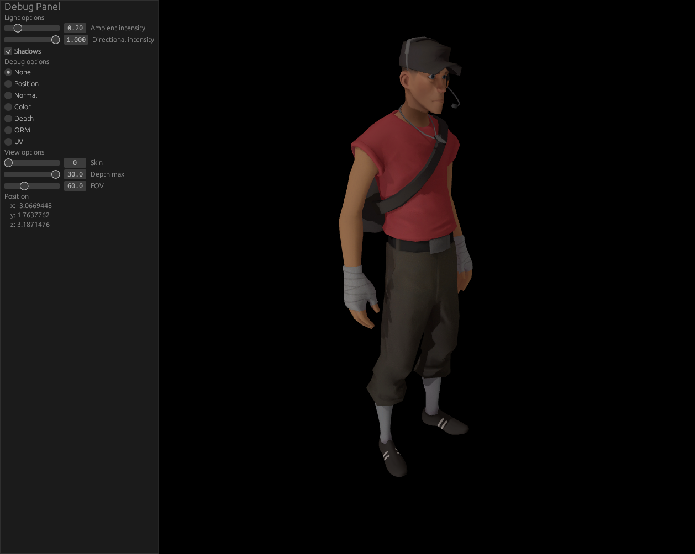

# Moved to https://codeberg.org/icewind/vmdl

# VMDL

Rust parser for source engine model files (`.mdl`, `.vtx`, `.vvd`)



## Examples

All examples require the `.mdl`, `.vvd` and `.dx90.vtx` to be next to each other and TF2 to be installed to load the texture data from.

## Viewer

```bash
cargo run --release --example view <path-to-mdl>
```

## Convert to gltf

```bash
cargo run --release --example gltf <path-to-mdl> <path-for-output-gtb>
```
